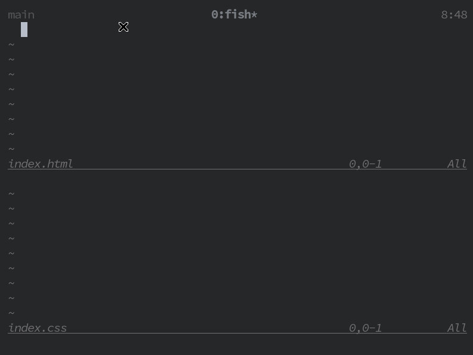

# emmet-ls

[coc-emmet](https://github.com/neoclide/coc-emmet) replacement for [completion-nvim](https://github.com/nvim-lua/completion-nvim).



Emmet support based on LSP.

#### Install
```
npm install -g emmet-ls
```

#### Configuration 

- [nvim-lspconfig](https://github.com/neovim/nvim-lspconfig)
  ```lua
  local nvim_lsp = require'lspconfig'
  local configs = require'lspconfig/configs'
  local capabilities = vim.lsp.protocol.make_client_capabilities()
  capabilities.textDocument.completion.completionItem.snippetSupport = true

  configs.emmet_ls = {
    default_config = {
      cmd = {'emmet-ls', '--stdio'};
      filetypes = {'html', 'css'};
      root_dir = function()
        return vim.loop.cwd()
      end;
      settings = {};
    };
  }

  nvim_lsp.emmet_ls.setup{
    on_attach = on_attach;
  }
  ```
- [completion-nvim](https://github.com/nvim-lua/completion-nvim)

  Completion is triggered if completion_trigger_character is entered. 
  It's limitation of completion-nvim.

  ```lua
  let g:completion_trigger_character = ['.']
  ```
  If you have set it like this, You will have to add trailing '.' after emmet abbreviation.
  ```
  div>h.
  ```
  will be expanded to 
  ```
  <div>
    <h class=""></h>
  </div>
  ```


